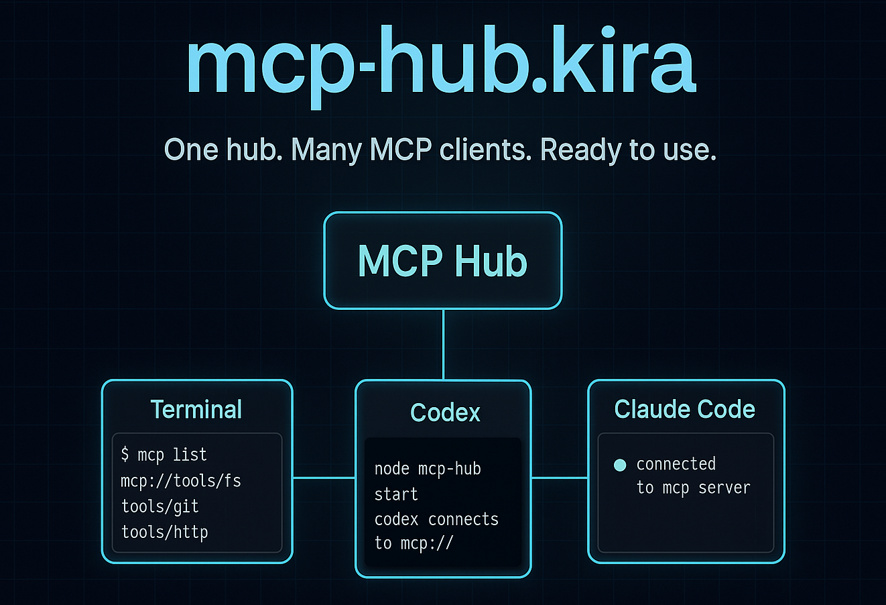

## Made with ❤️ by the Kira.id open-source AI research team

This repository ships a ready-to-run [mcp-hub](https://www.npmjs.com/package/mcp-hub) configuration so you can aggregate multiple MCP servers behind one HTTP endpoint.

## Repository Layout

- `config/mcp-hub.json` — Sample hub configuration that launches each STDIO MCP server through `npx`.
- `.env.example` — Environment template; copy to `.env` and fill in your API tokens.
- `scripts/install-mcp-hub.sh` — Helper that builds the bundled `mcp-hub` CLI once per machine using npm.

## Requirements

- Node.js 18 or newer
- npm 9+ (bundled with Node.js 18) — includes `npx`

## Install the Hub Locally

Run the helper script to build and link the CLI from the vendored `mcp-hub` source:

```bash
./scripts/install-mcp-hub.sh
```

The script runs `npm install` and `npm run build` inside `./mcp-hub`, then symlinks `/usr/local/bin/mcp-hub` to the compiled CLI.

## Configure Secrets

```bash
cp .env.example .env
# edit .env with your real tokens
```

During local development you can keep the `.env` file in the project root (it is gitignored) or export the variables manually.

## Run the Hub

Load your secrets and start the hub with the provided config:

```bash
export $(grep -v '^#' .env | xargs) \
  && mcp-hub --port 37373 --config "$(pwd)/config/mcp-hub.json"
```

Point MCP clients (Claude Desktop, Cline, etc.) to `http://<host>:37373/mcp`.

Prefer not to install the binary globally? You can also run the published package directly:

```bash
npx mcp-hub@latest --port 37373 --config "$(pwd)/config/mcp-hub.json"
```

To add the hub to the Codex CLI configuration:

````
experimental_use_rmcp_client = true

[mcp_servers.kira]
url = "http://localhost:37373/mcp"
````

## Working with `config/mcp-hub.json`

Each entry in `mcpServers` spawns an MCP server using `npx`. Ensure your configuration resembles the following structure:

```json
{
  "mcpServers": {
    "context7": {
      "command": "npx",
      "args": [
        "@upstash/context7-mcp",
        "--api-key",
        "${env:CONTEXT7_API_KEY}"
      ]
    }
  }
}
```

Add or remove servers as needed and keep API keys in your environment rather than hardcoding them.

## Auth Token Handling

- **Local development** — load values from `.env` or export them in your shell session.
- **Shared hosts** — prefer a secret manager (1Password, AWS SSM, Doppler, etc.) and reference them with `${cmd:...}` in the config if you do not want tokens on disk.
- **Per-user access** — set `MCP_HUB_ENV` before launching the hub so injected values stay isolated per user:
  ```bash
  MCP_HUB_ENV='{"CONTEXT7_API_KEY":"...","UNSPLASH_ACCESS_KEY":"..."}' \
    mcp-hub --port 37373 --config /path/to/config/mcp-hub.json
  ```
- Rotate API keys periodically and restart the hub (`POST /api/restart` or restart the process) to pick up new values.

## Deployment Ideas

- **Systemd service** (Linux)
  1. Create a dedicated user (e.g. `mcp`) that owns the project directory and `.env` file.
  2. Drop a unit in `/etc/systemd/system/mcp-hub.service`:
     ```ini
      [Unit]
      Description=MCP Hub
      After=network.target

      [Service]
      Type=simple
      EnvironmentFile=/home/mcp/projects/mcp-hub.kira/.env
      ExecStart=/usr/local/bin/mcp-hub --port 37373 --config /home/mcp/projects/mcp-hub.kira/config/mcp-hub.json
      Restart=on-failure

      [Install]
      WantedBy=multi-user.target
     ```
  3. Enable and start it: `sudo systemctl enable --now mcp-hub`.
- **Docker** — wrap a minimal Node image, copy the config, and inject secrets with Docker secrets or environment variables.

Monitor the hub with `/api/health` or the SSE stream at `/api/events` to confirm all servers remain connected.
